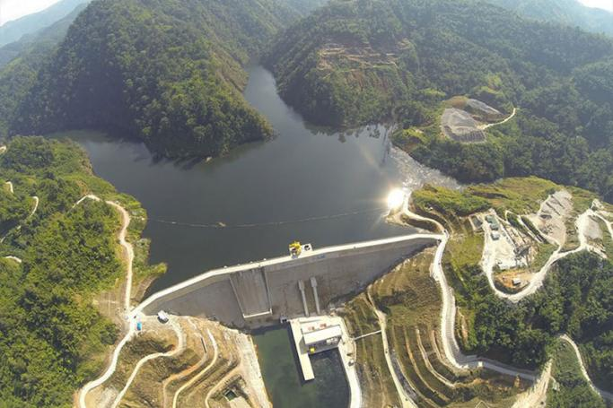

<link rel="stylesheet" href="https://cdn.jsdelivr.net/gh/devicons/devicon@v2.14.0/devicon.min.css">

<!-- .slide: style="text-align: center;"> -->
<h2> Planning reservoirs with Greenhouse Gas Emission models</h2>

---

---

<h4>Exploration of Multidimensional Datasets</h4>

<iframe class="r-stretch" 
style="border-radius: 20px; box-shadow: 15px 15px 35px rgba(180, 180, 180, 0.35);"
src="https://drawit-moea-results.onrender.com/" frameborder="0" allowfullscreen>
</iframe>

Source: <a href="https://drawit-moea-results.onrender.com/"> https://drawit-moea-results.onrender.com/</a>

---

## Areas of Interest

 <ol id="small-text">
  <li id="padded-li"><b style="color: #e65609">AI-assisted decision-making</b> on large multi-dimensional datasets.</li>
  <li id="padded-li">Further exploration of <b style="color: #2496b3">explainability and fairness</b> of prediction models.</li>
  <li id="padded-li">Decision support with <b style="color: #51960c">LLMs</b>.</li>
  <li id="padded-li"><b style="color: #e6a009">Fusion of</b> knowledge-based and data-based <b style="color: #e6a009">prediction models</b>.</li>
</ol> 
